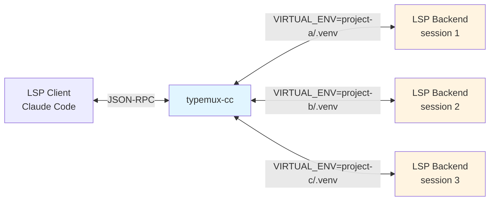
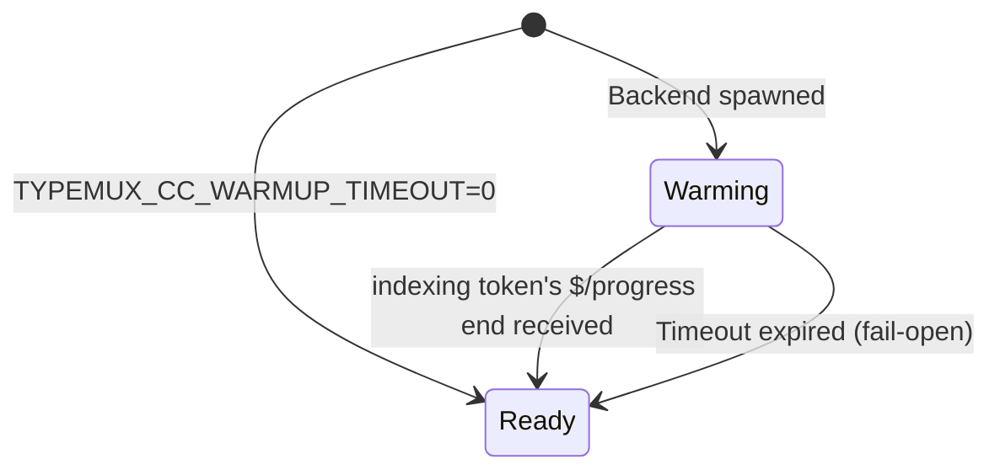
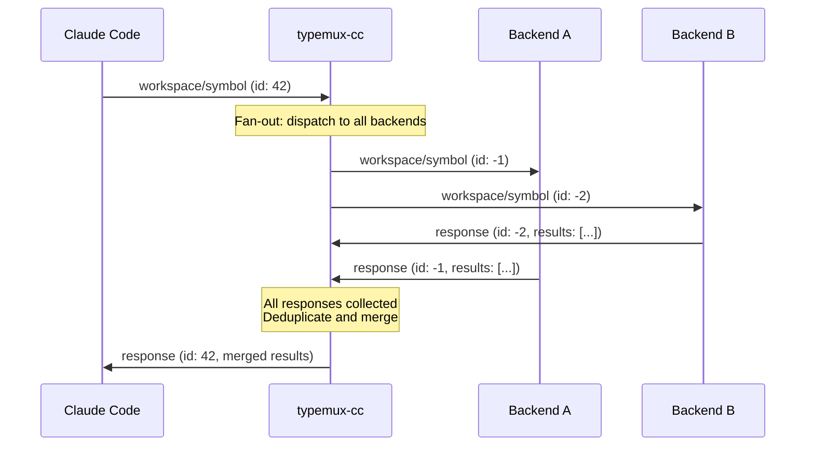
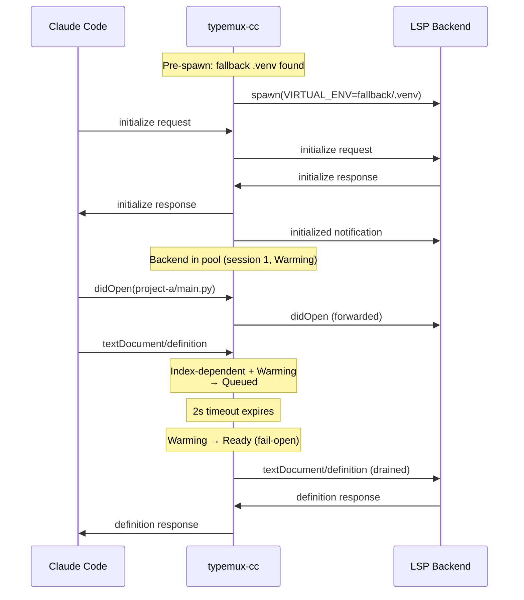
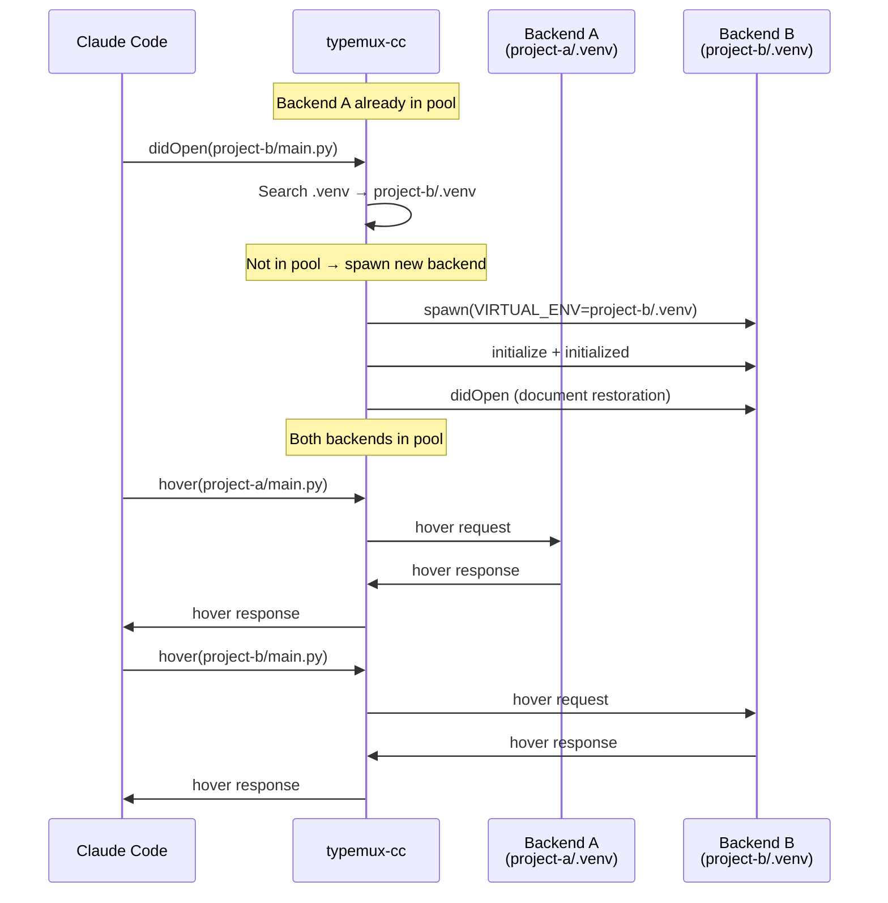
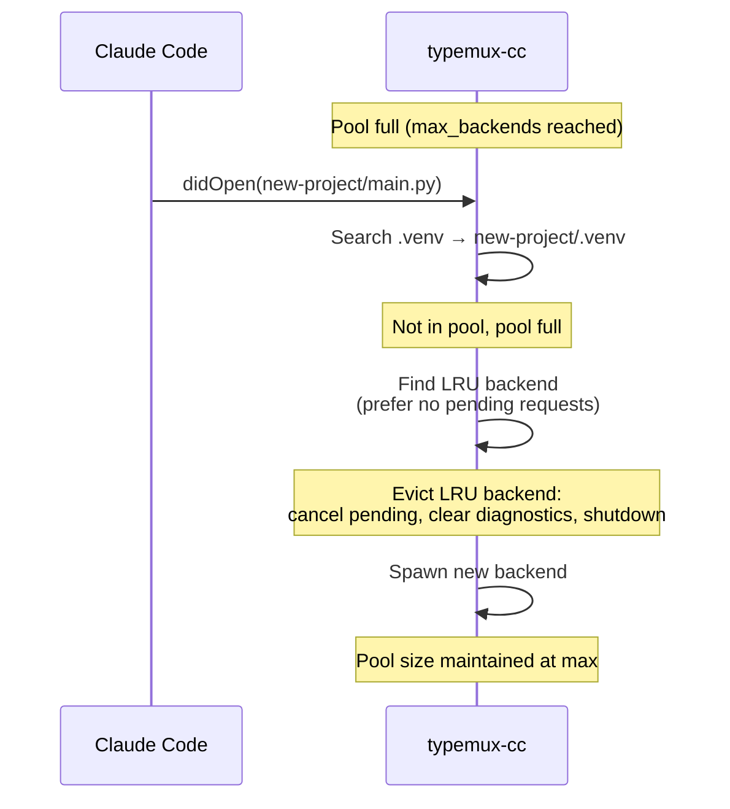
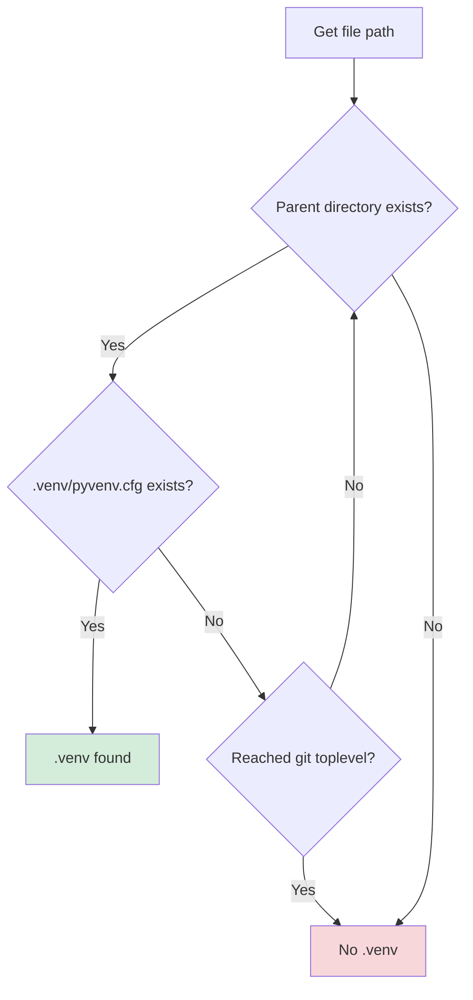

# Architecture

> This document explains _why_ typemux-cc is built this way.

Design philosophy, state transitions, and internal implementation details.
For usage, see [README.md](../README.md).

## Non-goals

- No support for LSP clients other than Claude Code
- No environment resolution for anything other than `.venv` (poetry/conda, etc.)
- No simultaneous parallel operation of multiple backend types (always one type per proxy instance)

## Background: Why This Tool Is Needed

### Python Type-Checker Limitation

Python type-checker LSP servers (pyright, ty, pyrefly) read environment variables `VIRTUAL_ENV` and `sys.path` at startup to determine the Python interpreter and dependencies ([LSP-pyright README](https://github.com/sublimelsp/LSP-pyright), [Pyright discussions #4420](https://github.com/microsoft/pyright/discussions/4420)). Creating `.venv` after startup doesn't cause already-running processes to reload environment variables.

### Claude Code's Limitation

Per LSP specification, dynamically changing environment variables requires restarting the language server process ([LSP Mode FAQ](https://emacs-lsp.github.io/lsp-mode/page/faq/), [Helix issue #9398](https://github.com/helix-editor/helix/issues/9398)). However, Claude Code's LSP plugin architecture has these constraints:

- Even if you manually kill the LSP process, Claude Code cannot reconnect to a new process
- Processes spawned by the plugin are tied to Claude Code's session lifecycle
- **As a result, enabling `.venv` requires restarting Claude Code itself**

typemux-cc breaks through this limitation by inserting a proxy between Claude Code and the backend.

## Design Principles

### "A Silently Lying LSP Is the Worst"

Running with the wrong `.venv` is worse than disabling LSP functionality and returning errors.

**Why?**

- Offering completions with wrong dependencies generates code that imports non-existent modules
- Type checking appears to pass, but fails at runtime
- Developers continue coding based on false information, believing "LSP is working"

**typemux-cc's Choice**

- **Explicitly return errors** when `.venv` is not found
- Explain the situation in error messages so users can take action
- "Getting an error" is healthier than "nothing happening"

## Architecture Overview

### Overall Structure



The proxy sits between Claude Code and multiple LSP backends (pyright, ty, or pyrefly), performing:

1. **Message routing**: Route JSON-RPC messages to the correct backend based on document venv
2. **venv detection**: Search for `.venv` on:
   - `textDocument/didOpen` (always)
   - Any URI-bearing LSP request on cache miss (fallback to full venv resolution)
   - NOTE: Cached documents reuse the last known venv and are not re-searched
3. **Multi-backend pool**: Manage concurrent backend processes (one per venv, up to `max_backends`)
4. **State restoration**: Resend open documents when spawning a new backend
5. **Diagnostics cleanup**: Clear diagnostics for documents outside the target venv
6. **Warmup readiness**: Queue index-dependent requests until backends finish building their cross-file index

## Multi-Backend Pool

### Design

Instead of running a single backend and restarting on venv changes, typemux-cc maintains a **pool of concurrent backend processes** — one per venv. This eliminates restart overhead when switching between projects in a monorepo.

### Pool Management

| Feature | Description | Configuration |
|---------|-------------|---------------|
| Max backends | Upper limit on concurrent backend processes | `--max-backends` / `TYPEMUX_CC_MAX_BACKENDS` (default: 8) |
| LRU eviction | When pool is full, evict the least recently used backend | Prefers backends with no pending requests |
| TTL eviction | Automatically evict idle backends after a timeout | `--backend-ttl` / `TYPEMUX_CC_BACKEND_TTL` (default: 1800s) |
| Session tracking | Each backend gets a unique session ID for stale message detection | Monotonically increasing counter |

### Session Tracking

```rust
pub struct BackendInstance {
    pub session: u64,       // Unique session ID
    pub last_used: Instant, // For LRU tracking
    // ...
}
```

Each backend gets a unique session ID. Pending requests store which session they were sent to. If a response arrives from an old session (evicted/crashed backend), it's discarded as stale.

```rust
pub struct PendingRequest {
    pub backend_session: u64, // Which backend session was this request sent to?
    pub venv_path: PathBuf,
}
```

### Creating State

Backend creation (process spawn → `initialize` handshake → document restoration) never runs inline on the event loop. Each creation runs in its own `tokio::spawn`ed task, reported back via a dedicated `creation_rx` channel — the same "reader/writer/handler as independent tasks" shape session tracking already uses for a running backend, applied to the window before one exists.

```rust
pub struct CreatingEntry {
    pub session: u64,            // allocated up front, carried into the Ready BackendInstance
    pub queued: Vec<RpcMessage>, // messages that arrived while this venv was Creating
}
```

`BackendPool` tracks `creating: HashMap<PathBuf, CreatingEntry>` as a map **separate** from `backends`: LRU/TTL/staleness/warmup logic applies only to `Ready` backends, so folding both states into one map would force every one of those call sites to branch on state.

**Why restoration has to live inside the spawned task, not just after a `into_split()` done inline.** Splitting the backend and starting its reader task before writing restored documents fixes the narrow case (a reader now exists to drain diagnostics). It does not fix the general case: while a `select!` arm's handler is `.await`ing inline, the other arms — including the one draining `backend_msg_rx` (capacity 1024) — are not polled. A restoration burst past that capacity parks the reader task on its channel send, the backend's own stdout pipe backs up behind it, the backend blocks writing and stops reading its stdin, and if that same arm still has more to write, the whole proxy deadlocks. True deadlock-freedom requires the reader task, the creation task, and the main loop to be three independent tokio tasks, so the main loop keeps draining `backend_msg_rx` no matter what the creation task's writer is doing. Spawning the whole creation (including restoration) as its own task is what buys that independence.

**Queueing and replay.** A message that targets a `Creating` venv is appended to that entry's `queued` (capped at `MAX_CREATING_QUEUE_LEN = 64`, its own constant independent of the warmup queue's). `ensure_backend_in_pool` returns a `PoolLookup`:

```rust
enum PoolLookup {
    Ready(PathBuf),          // forward directly
    CreatingStarted(PathBuf),   // this call's own snapshot already covers a same-tick didOpen
    CreatingInFlight(PathBuf),  // a creation was already running; queue this message
    NotFound,
}
```

The `Started`/`InFlight` distinction only matters for `didOpen`: the restoration snapshot is a clone of `open_documents` taken synchronously when the creation task is spawned, so a `didOpen` that triggered the creation itself is already in that snapshot (no further action), while one that lands mid-handshake is not and must be queued. `didChange` and requests are always queued in both `Creating` variants.

**Deferred cache mutations.** A replayed message is ordinary redispatch through the exact same dispatch arm a live message would take (see Event Loop below), which makes `didClose`'s cache removal and `didChange`'s edit application unsafe to apply eagerly for a `Creating` venv: applying now *and* again on replay would double-apply a non-idempotent edit, or (for `didClose`) remove the document before the replay pass's own venv lookup can resolve it, silently losing the close a second time. Both defer their mutation instead, to whichever pass turns out to be the one that actually delivers the message — immediately, if the venv is `Ready`; otherwise on replay. `forward_or_queue_for_venv` reports which of four things happened (`NotificationDelivery`: `Forwarded`, `Queued`, `Dropped`, `NoBackend`), and the deferral is only safe for `Queued` — the one outcome guaranteed a future replay. `Dropped` (the `MAX_CREATING_QUEUE_LEN = 64` cap rejected it) or `NoBackend` both mean nothing will ever redeliver the message, so the caller applies the deferred mutation immediately instead: delivery to the in-flight backend is lost (the client already got the dedup'd overflow `window/showMessage`), but the cache stays coherent, so the next respawn's restoration snapshot reflects the truth instead of resurrecting a closed document or restoring stale text.

When the creation task finishes, the `creation_rx` select! arm (the only code path allowed to remove a `Creating` entry) handles the outcome:

- **Success**: insert the new `BackendInstance` into `backends`, then move `queued` into a global `ProxyState::replay_queue: VecDeque<RpcMessage>` — a plain `VecDeque::extend`, no backend I/O. A dedicated select! arm re-dispatches exactly **one** replayed message per loop iteration (never a batch loop — a burst of replayed `didOpen`s could itself exceed `backend_msg_rx`'s capacity), through the same dispatch path as an ordinary client message. The main `select!` is *not* `biased;` (see Event Loop below), so "real backend traffic drains before a replay" can no longer come from arm order; the replay arm enforces it itself with a non-blocking `backend_msg_rx.try_recv()` immediately before dispatching: if a backend message is already there, dispatch that instead and push the replay back to the front of the queue for the next iteration.
- **Failure**: every queued *request* gets an immediate JSON-RPC error response. Queued *notifications* go into `replay_queue` too, exactly like the success arm — even though there's no backend left for them to reach, redispatching them is what runs their deferred cache mutation (see above); without it, a queued `didClose`/`didChange` behind a failed creation would leave the cache permanently stale. A replayed `didOpen` finding the venv absent starts one fresh creation attempt — bounded, not a retry loop, since a repeat failure has nothing left queued to replay and the failure notification is already deduplicated.

**Pool capacity.** `is_full()` counts `backends.len() + creating.len()`: a creation task holds a real process even before it's `Ready`. If the pool is full and no `Ready` backend is evictable (every slot is `Creating`), backend creation is rejected outright with `ProxyError::PoolBusy` — surfaced as an immediate JSON-RPC error, no implicit waiting.

**Known v1 gaps** (accepted, not fixed): fan-out (`workspace/symbol`) only targets `pool.backends_keys()`, so a `Creating` venv is silently excluded — unchanged, existing best-effort semantics. (`didClose` for a `Creating` venv used to be a similar no-op; it's now queued and replayed like any other message — see Event Loop below.) A `window/workDoneProgress/create` request landing during Creating can't be answered either — there's no reachable backend writer yet, it's owned by the in-flight creation task — but its token IS recorded onto `CreatingEntry.indexing_progress_token` and carried into the `BackendInstance` on success, so the warmup Ready trigger described below still recognizes a matching `end` that arrives after the backend is pooled (see #104). If the matching `end` itself also lands during the Creating window, that fact is not carried over — the backend stays Warming and converges via the warmup fail-open timeout, never via a wrong early Ready. `window/workDoneProgress/create` stays a deliberate exception, not extended by the fix below: a queued `create` would only reach the client after the instance is pooled, arbitrarily later than the `$/progress` notifications for the same token (which are forwarded live, on the spot — see above), producing a client-visible begin→end→create ordering violation for a backend that doesn't wait for the create ack (pyright doesn't). The complete fix (queue the create and its subsequent same-token `$/progress` together, replayed in order) would collide with the live-drain requirement above, so it's out of scope (#134).

**Server-initiated requests during Creating (#134).** Every OTHER request kind a backend sends while still `Creating` — most notably `workspace/configuration`, which pyright 1.1.407 sends three of, right after `initialized` — is queued onto `CreatingEntry.server_requests` (capped at `MAX_CREATING_SERVER_REQUEST_QUEUE_LEN = 64`, its own constant: a different direction and overflow/drain shape than the client→backend `queued` above, so not folded into it). Unlike `window/workDoneProgress/create`, these have no ordering coupling to a live notification stream, so deferring them is safe. On success, each queued request is forwarded to the client through the same proxy-ID-rewriting path (see Backend-to-Client Request Proxying below) a `Ready` backend's request gets, once the instance is inserted into `backends` — the client's eventual response then routes back through the ordinary `pending_backend_requests` machinery, since that registration happens at forward time, after insertion. On failure, queued server-initiated requests are dropped (debug log) — nothing was ever registered for them, so there's nothing to leak.

## Backend-to-Client Request Proxying

LSP backends can send requests to the client (e.g., `window/workDoneProgress/create`). With multiple backends, their request IDs can collide.

### Solution: Proxy ID Rewriting

1. Backend sends request with its own ID (e.g., `id: 1`)
2. Proxy allocates a unique negative proxy ID (e.g., `id: -1`) to avoid collision with client IDs (positive)
3. Original ID is stored in `pending_backend_requests`
4. Message forwarded to client with rewritten ID
5. Client response routed back, ID restored to original

```rust
pub struct PendingBackendRequest {
    pub original_id: RpcId,   // Backend's original ID
    pub venv_path: PathBuf,
    pub session: u64,
}
```

### Progress Token Namespacing (#104)

The request ID above dedupes the `workDoneProgress/create` round-trip itself, but LSP's `ProgressToken` (`integer | string`, carried in `params.token` on both `window/workDoneProgress/create` and `$/progress`) is a *separate* value the client keeps around for later `$/progress` matching and `window/workDoneProgress/cancel` — untouched, it can collide the same way request IDs would. `proxy::progress_token` (`src/proxy/progress_token.rs`) rewrites it stateless-ly, reusing `RpcId` as the token type (its `Number(i64) | String(String)` shape already matches `ProgressToken` exactly):

- **Backend → client** (`create` request, `$/progress` notification): `params.token` is rewritten to `tmx:{session}:{n|s}:{original}` before forwarding. The `n`/`s` tag preserves whether the original was a JSON number or string, so the rewrite is lossless in both directions. No side table — the session is encoded directly in the string, so there's nothing to clean up on backend eviction/crash.
- **Client → backend** (`window/workDoneProgress/cancel`): the prefixed token is decoded back to `(session, original_token)`; the notification is forwarded to that ONE backend (via `BackendPool::get_mut_by_session`) with the ORIGINAL token restored — never broadcast to every backend (the generic notification path has no `textDocument.uri` to route `workDoneProgress/cancel` by, so without this special case it would go out to all of them, still holding the client's prefixed token, which none of them minted). If the token isn't proxy-namespaced, or its session no longer resolves to a pooled backend, the notification is dropped with a debug log.
- **Client-initiated requests carrying `workDoneToken` in their own params** (e.g. a `textDocument/definition` request's `workDoneToken`) are left untouched: they flow inside a request already routed to one specific backend, so there's no cross-backend collision surface for the proxy to namespace against.

## Warmup Readiness

### Problem

After spawning, backends need time to build their cross-file index. Requests sent during this warmup period return incomplete results:

- `findReferences` returns same-file results only (missing cross-project references)
- `goToDefinition` on re-exported symbols returns empty

### Solution: Warming/Ready State with Bounded Timeout



Each `BackendInstance` tracks its warmup state:

```rust
pub enum WarmupState {
    Warming, // Queueing index-dependent requests
    Ready,   // All requests forwarded normally
}
```

### Behavior During Warmup

| Request type | During Warming | After Ready |
|-------------|----------------|-------------|
| `textDocument/definition` | **Queued** | Forwarded |
| `textDocument/references` | **Queued** | Forwarded |
| `textDocument/implementation` | **Queued** | Forwarded |
| `textDocument/typeDefinition` | **Queued** | Forwarded |
| `textDocument/hover` | Forwarded immediately | Forwarded |
| `textDocument/documentSymbol` | Forwarded immediately | Forwarded |
| `textDocument/didOpen` | Forwarded immediately | Forwarded |
| Other requests/notifications | Forwarded immediately | Forwarded |

### Ready Transition Triggers (OR logic)

1. **`$/progress` notification** with `kind: "end"` AND a `token` matching this backend's own recorded indexing-progress token — the token of the FIRST `window/workDoneProgress/create` request the backend sent while Warming (`BackendInstance::indexing_progress_token`, or `CreatingEntry::indexing_progress_token` if it arrived before the backend was even inserted — see #104). Matched against the ORIGINAL backend-side token, never the client-visible namespaced one. A kind-only match (any `$/progress end`, regardless of token) was #104's bug: an unrelated progress stream could release queued index-dependent requests early. Identified structurally, not by title — pyright 1.1.407's indexing `begin` carries an empty `title`, so title-matching wasn't viable anyway. Confirmed (2026, this capture): `ty` 0.0.58 and `pyrefly` 1.1.1 never send `$/progress` at all, so this trigger never fires for them — they rely solely on trigger 2.
2. **Bounded timeout** (default 2s, configurable via `TYPEMUX_CC_WARMUP_TIMEOUT`) expires — **fail-open**: forward queued requests anyway

### Configuration

| Env var | Default | Description |
|---------|---------|-------------|
| `TYPEMUX_CC_WARMUP_TIMEOUT` | `2` (seconds) | Warmup timeout duration |
| `TYPEMUX_CC_WARMUP_TIMEOUT=0` | — | Disable warmup entirely (immediate Ready) |
| `TYPEMUX_CC_WARMUP_TIMEOUT=<non-integer>` | — | Startup fails with an explicit error |

## Strict Venv Mode

### Design Intent

As stated in the design principles, disabling is better than running with the wrong venv.
Strict Venv Mode implements this philosophy.

### Behavior

| Condition | Behavior |
|-----------|----------|
| File opened, `.venv` found, backend in pool | Forward to existing backend |
| File opened, `.venv` found, backend NOT in pool | Spawn new backend, add to pool |
| File opened, `.venv` NOT found | Return error (`-32603: .venv not found`) |
| Pool full, new backend needed | Evict LRU backend, then spawn new one |
| `initialize` (no fallback .venv) | Return success with `capabilities: {}` (prevents Claude Code error state) |
| URI-bearing request, cache miss | Attempt full venv resolution via `ensure_backend_in_pool` |
| URI-bearing request, non-file URI | Return error (cannot resolve venv for non-file scheme) |
| URI-less request (e.g., `workspace/symbol`), single backend | Forward to sole backend (no cross-contamination risk) |
| URI-less fan-out request (e.g., `workspace/symbol`), multiple backends | Fan-out to all backends, merge deduplicated results |
| URI-less non-fan-out request, multiple backends | Return error (cannot determine target venv) |

### Cache Limitation (Important)

Two distinct caches can go stale, and they fail differently:

1. **Document venv cache** (`open_documents[uri].venv`): resolved at `didOpen`.
   If no venv existed then (`venv: None`), it **is** re-searched on the next
   URI-bearing request, so a late-created `.venv` is picked up without
   reopening the file. A cached `Some(venv)` is trusted as long as the venv's
   identity is unchanged.
2. **Backend pool identity** (`pool[venv_path]`): keyed by path only. Without
   identity tracking (below), a backend would keep serving after its `.venv`
   was replaced or deleted — the "silently lying LSP" failure mode.

## Venv Identity Tracking

### Problem

`uv sync` deletes and recreates `.venv`. The pool key (the venv *path*) is
unchanged, so without an identity check the old backend — indexed against the
old environment — keeps answering. Per the design principles, this is the
worst possible failure mode: results look plausible and are wrong.

### Identity Token

Each backend captures a `VenvToken` at spawn: `dev`/`ino`/`mtime`/`size` of
`.venv/pyvenv.cfg`. Recreation allocates a new inode; in-place edits change
mtime/size.

### Check Triggers and Outcomes

Checks are debounced to once per `TYPEMUX_CC_VENV_CHECK_INTERVAL` seconds
(default 5; `0` disables tracking; a non-integer value fails startup with an
explicit error). Triggers: `ensure_backend_in_pool`
(all venv-checked request methods), `didOpen`/`didChange` forwarding, and a
60s background sweep (shared with the TTL timer, armed even when TTL is
disabled).

| Observation | Behavior |
|-------------|----------|
| Token unchanged | Serve as usual |
| Token mismatch (venv replaced) | Evict old backend (cancel pending, clear diagnostics, shutdown), notify client via `window/showMessage`, start creating a new one (`Creating`, off the event loop — see Creating State) — exactly once per change |
| Token mismatch, creation fails to even start (e.g. pool busy) | Contained, never fatal: notify the client via `window/showMessage`, keep serving other venvs; the next request for this venv retries backend creation via the pool-miss path |
| `pyvenv.cfg` missing < grace (2 × interval) | Keep serving the old backend (transient `uv sync` window) |
| `pyvenv.cfg` missing ≥ grace | Evict without respawn; reset affected documents' cached venv so the next request re-resolves it — usually the strict-mode ".venv not found" error |

The background sweep evicts without respawning (the next request lazily
respawns), so an idle stale backend is corrected within ~60s even if no
request ever targets it again.

Staleness eviction reuses the standard eviction path, so the session-id
mechanism guarantees late messages from the evicted process are discarded.

## Fan-Out for URI-less Requests

### Problem

Some LSP methods like `workspace/symbol` have no document URI, so the proxy cannot determine which backend to route to. Previously, these requests returned an error when multiple backends were active.

### Solution: Fan-Out with Merge

For methods in the `FANOUT_METHODS` list (currently `workspace/symbol`), the proxy fans out the request to **all** active backends, collects results, deduplicates, and returns a merged response.



### Deduplication

Results are deduplicated using the key: `(uri, range.start.line, range.start.character, name, kind)`. Items with missing fields are kept defensively.

### Timeout and Partial Results

If a backend does not respond within the fan-out timeout (default 5s, configurable via `TYPEMUX_CC_FANOUT_TIMEOUT`; a non-integer value fails startup with an explicit error):

1. A `window/showMessage` warning is sent to the client listing timed-out backends
2. `$/cancelRequest` is sent to remaining backends (best effort)
3. Partial results from completed backends are returned

If **all** backends fail (errors or timeouts with no results), an explicit error response is returned.

### Backend Crash During Fan-Out

If a backend crashes or is evicted during a fan-out, its sub-request is removed and `expected_count` is decremented. The fan-out completes with results from surviving backends.

## Operation Sequences

### Sequence 1: Startup with Fallback Venv



### Sequence 2: Multi-Venv Routing



### Sequence 3: LRU Eviction



## `.venv` Search Logic

### Search Algorithm



### Search Rules

1. **Starting point**: Parent directory of opened file
2. **Verification**: Check existence of `.venv/pyvenv.cfg`
3. **Boundary**: git toplevel (git repository root obtained at startup)
4. **Direction**: Traverse parent directories upward

### Fallback `.venv` Search Order

Determines initial virtual environment at startup:

1. `.venv` at git toplevel
2. `.venv` at cwd (current working directory)
3. Start without venv if neither exists

## Document State Cache

The proxy internally holds file contents received via `textDocument/didOpen` and `textDocument/didChange`.

### Why Needed?

1. **Restoration on Backend Spawn**

   - After starting backend with new venv, open files need to be resent
   - Client (Claude Code) still has files open, so backend state must be restored

2. **Revival Preparation While No Backend**
   - Even without an active backend for a document's venv, `didChange` contents continue to be recorded
   - When the correct backend is spawned later, it starts with the latest document state

### Cached Information

- File URI
- languageId (`python`, etc.)
- Version number
- Full text content
- Associated venv path

### Storage

- **Memory only** (not saved to disk)
- Cleared when proxy process terminates
- Automatically cleared when Claude Code restarts

### Selective Restoration

When spawning a backend for project-b/.venv, only documents under project-b/ are restored.
Documents under project-a/ are skipped. Skipped documents get empty diagnostics sent to clear stale errors.

## Main Features

| Feature | Description |
|---------|-------------|
| JSON-RPC framing | Read/write LSP messages with Content-Length headers |
| Multi-backend pool | Concurrent backend processes, one per venv |
| LRU eviction | Evict least recently used backend when pool is full |
| TTL-based eviction | Auto-evict idle backends (default: 30 min) |
| `.venv` auto-detection | Detect by traversing parent directories |
| Fallback `.venv` | Pre-spawn backend with initial venv at startup |
| Warmup readiness | Queue index-dependent requests until backend index is built |
| Document state caching | Remember open file contents for restoration |
| Selective restoration | Restore only documents under the target venv |
| Incremental sync | `textDocument/didChange` partial update support |
| Backend→client proxying | Proxy ID rewriting for multiplexed backend requests |
| `$/cancelRequest` handling | Cancel warmup-queued requests without forwarding |
| Fan-out requests | `workspace/symbol` dispatched to all backends with merged, deduplicated results |
| Strict venv mode | Return errors when no venv found |
| Venv identity tracking | Detect replaced/removed `.venv` (pyvenv.cfg identity token) and restart/evict the backend |
| Diagnostics cleanup | Clear stale diagnostics on backend eviction |

## Logging Configuration

### Method 1: Environment Variables (Quick)

```bash
TYPEMUX_CC_LOG_FILE=/tmp/typemux-cc.log ./target/release/typemux-cc
RUST_LOG=debug ./target/release/typemux-cc
```

### Method 2: Config File (Persistent)

typemux-cc reads config from:

```bash
~/.config/typemux-cc/config
```

**Setup**:

```bash
mkdir -p ~/.config/typemux-cc
cat > ~/.config/typemux-cc/config << 'EOF'
# Select backend (pyright, ty, or pyrefly)
export TYPEMUX_CC_BACKEND="ty"

# Enable file output
export TYPEMUX_CC_LOG_FILE="/tmp/typemux-cc.log"

# Adjust log level (optional)
export RUST_LOG="typemux_cc=debug"
EOF

# Restart Claude Code
```

### Log Levels

| Level   | Use Case                                      |
|---------|-----------------------------------------------|
| `debug` | Default. venv search details, LSP message method names |
| `info`  | venv switches, session info, warmup transitions |
| `trace` | All search steps, detailed debugging          |

### Useful Queries

```bash
# Real-time monitoring
tail -f /tmp/typemux-cc.log

# Warmup transitions
grep "warmup" /tmp/typemux-cc.log

# Backend pool activity
grep -E "(Creating new backend|Evicting|Backend warmup)" /tmp/typemux-cc.log

# Document restoration stats
grep "Document restoration completed" /tmp/typemux-cc.log

# Session transitions
grep "session=" /tmp/typemux-cc.log | grep -E "(Starting|completed)"
```

## Development

### Build & Test

```bash
# Format + Lint + Test
make all

# Individual commands
make fmt      # Code formatting
make lint     # Static analysis with clippy
make test     # Run unit tests
make release  # Release build

# For CI (includes format check)
make ci
```

### Source Code Structure

| File | Responsibility |
|------|----------------|
| `main.rs` | Entry point, CLI argument parsing, logging setup |
| `backend.rs` | LSP backend process management (pyright, ty, pyrefly) |
| `backend_pool.rs` | Multi-backend pool, LRU/TTL management, warmup state |
| `state.rs` | Proxy state: pool, documents, pending requests |
| `message.rs` | JSON-RPC message type definitions (RpcMessage, RpcId, RpcError) |
| `framing.rs` | JSON-RPC framing (Content-Length header processing) |
| `text_edit.rs` | Incremental text edit application for didChange |
| `venv.rs` | `.venv` search logic (parent traversal, git toplevel boundary) |
| `error.rs` | Error type definitions (ProxyError, BackendError, etc.) |
| `proxy/mod.rs` | Main event loop (`tokio::select!` with 7 arms) |
| `proxy/client_dispatch.rs` | Client message routing, warmup queueing, cancel handling |
| `proxy/backend_dispatch.rs` | Backend message routing, proxy ID rewriting, progress-token namespacing and indexing-token gated warmup detection |
| `proxy/progress_token.rs` | Stateless progress-token namespacing/decoding (`ProgressToken` ↔ `RpcId`) |
| `proxy/fanout.rs` | Fan-out dispatch, response merging, deduplication, timeout handling |
| `proxy/pool_management.rs` | LRU/TTL eviction, crash recovery, warmup expiry |
| `proxy/initialization.rs` | Backend initialization handshake, document restoration |
| `proxy/document.rs` | Document tracking (didOpen, didChange, didClose) |
| `proxy/diagnostics.rs` | Diagnostic message handling, stale diagnostics cleanup |

### Event Loop

The main event loop in `proxy/mod.rs` uses `tokio::select!` with 7 arms, unbiased (default randomized-order polling):

```
┌───────────────────────────────────────────────────────────┐
│                 tokio::select! (unbiased)                  │
├───────────────────────────────────────────────────────────┤
│ Client reader     │ mpsc channel (dedicated reader task)   │
│ Backend reader    │ mpsc channel (all backends)            │
│ Creation outcome  │ mpsc channel (backend-creation tasks)  │
│ TTL timer         │ 60s interval sweep                     │
│ Warmup timer      │ nearest warmup deadline                │
│ Fan-out timer     │ nearest fan-out deadline                │
│ Replay queue      │ one Creating-queued message/iteration  │
└───────────────────────────────────────────────────────────┘
```

**Not `biased;`.** An earlier version put `biased;` on this `select!` with the client reader listed first, to guarantee two orderings: backend traffic must drain before a replay (see Creating State), and — implicitly, by omission — nothing was thought to need priority *over* the client. Under sustained client input that second assumption breaks down: a `biased;` client-first `select!` can starve backend responses, creation outcomes, every timer, and replay indefinitely, and can reintroduce the #93 deadlock by a different path — a client flood plus a diagnostics burst fills `backend_msg_rx`, parking its reader task; the wedged backend stops reading its own stdin; a client-arm forward (e.g. `didChange`) then blocks writing to that backend's stdin; and the main loop is stuck with no other arm ever getting polled to drain the channel and unwedge it. The one real ordering requirement — backend traffic before a replay — doesn't need arm order to hold: it's enforced locally inside the replay arm instead, via a non-blocking `backend_msg_rx.try_recv()` immediately before dispatching a replay (see Creating State above).

**Client reads are a channel, not an inline read, for a second, independent reason.** `LspFrameReader::read_message()` spans multiple `.await` points (a `read_line` loop for headers, then `read_exact` for the body), and tokio documents `read_line` as not cancellation-safe: used directly as a `select!` branch, a read that's mid-frame when some other arm resolves first gets dropped, silently losing whatever header/body bytes it had already consumed from the stream and desyncing framing for every read after it — observed as spurious "Missing Content-Length header" errors that crash the whole proxy. This risk exists independently of `biased;`, but an unbiased `select!` visits the other arms more often, making it far easier to trigger. The client reader now runs on its own dedicated task, looping `read_message()` to completion with no `select!` in between, and forwards each parsed message over a channel — the same dedicated-task-plus-channel shape the backend reader already used for the identical reason (`mpsc::Receiver::recv()` **is** cancel-safe, so consuming from a channel inside `select!` is fine even though the read that fills it isn't).
